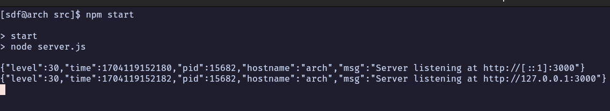
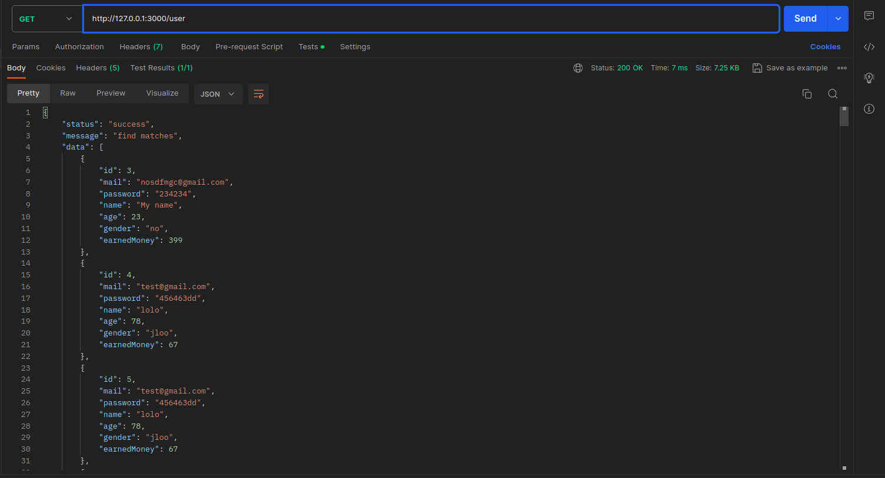
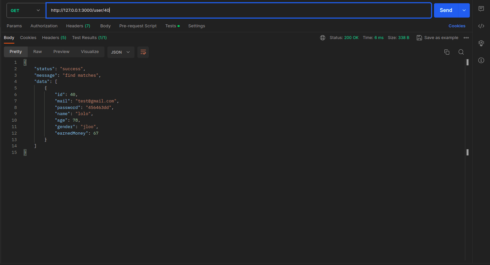
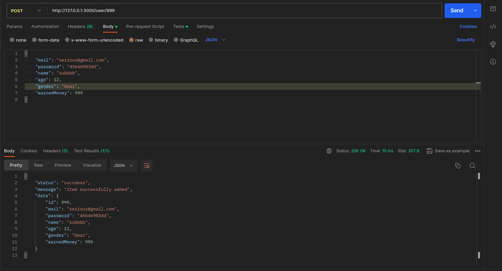
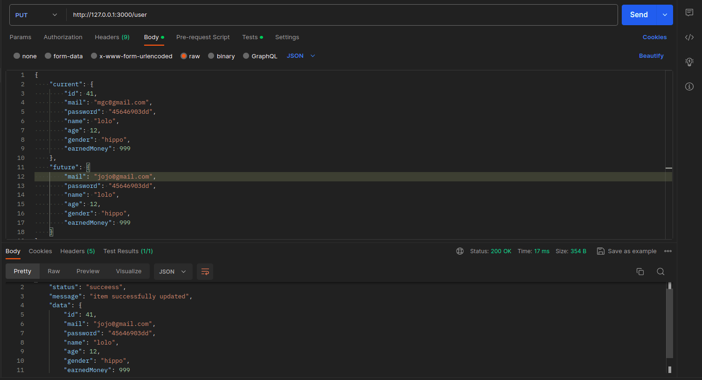
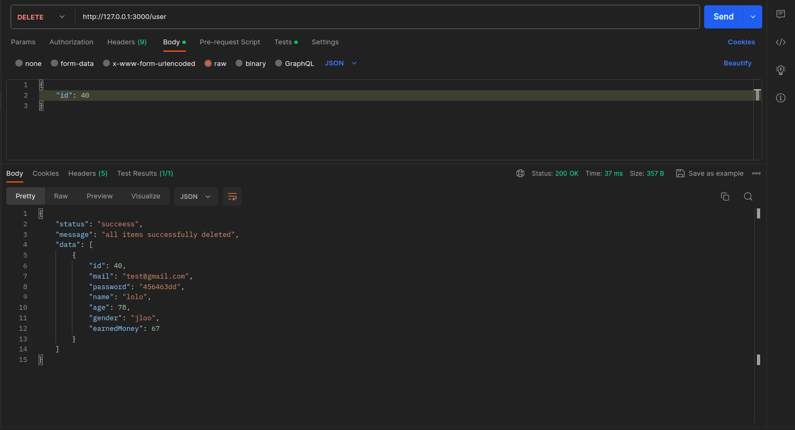

# Тестування працездатності системи

*В цьому розділі необхідно вказати засоби тестування, навести вихідні коди тестів та результати тестування.*

## Старт  системи

## Отримування всі користувачів

## Отримування користувача по id

## Створення користувача

## Оновлення користувача

## Видалення користувача

